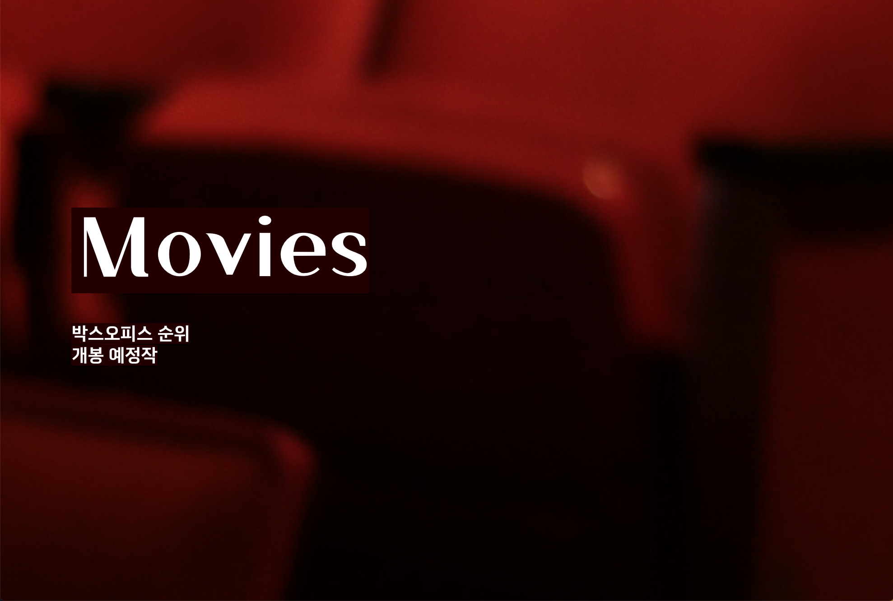
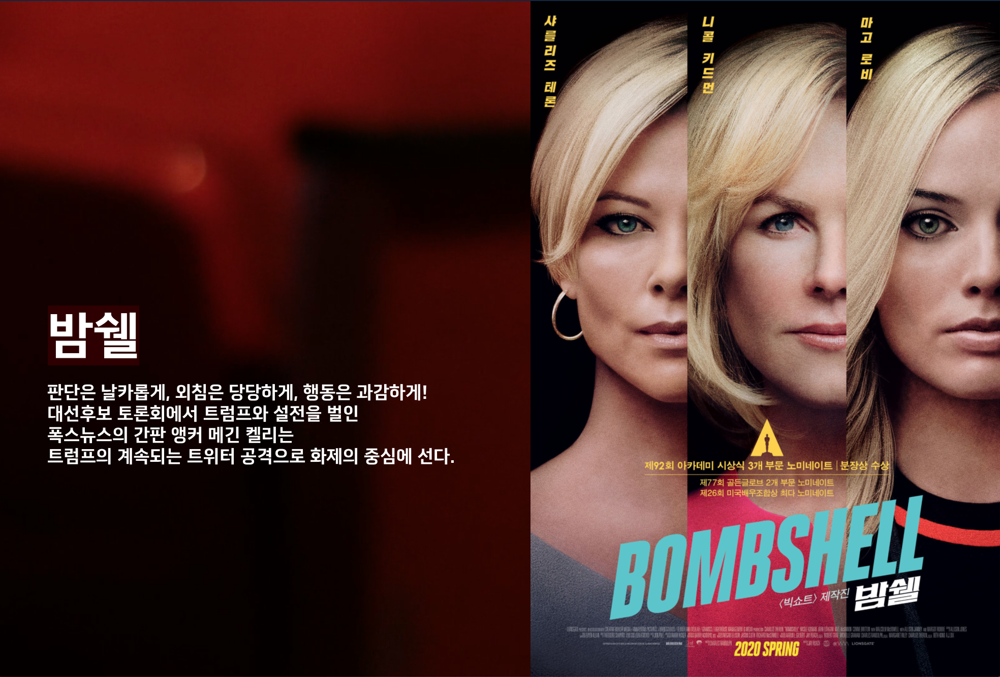

# web
반응형으로 작성한 작은 프로젝트들 (html, css, JavaScript)

## introduce
스크롤 인터렉션을 이용한 영화 소개 페이지 
 
{:width: "40%" }
{:width: "40%" }
https://surealyeun.github.io/web/introduce/

## sea
스크롤 인터렉션으로 동영상처럼 보이도록 하는 애니메이션 구현
 
https://surealyeun.github.io/web/sea/

## layout
table을 이용하지 않고 display는 flex, padding-bottom을 100%로 구현하여 변화하는 스크린 사이즈에 맞춰 정사각형 요소들이 자연스럽게 줄 바꿈하고 모양을 유지하도록 하였다.
 
https://surealyeun.github.io/web/layout/

## light-dark
반응형 웹에 neumorphism 디자인을 적용하여 light/dark 모드를 구현하였다.
 
https://surealyeun.github.io/web/light-dark/
